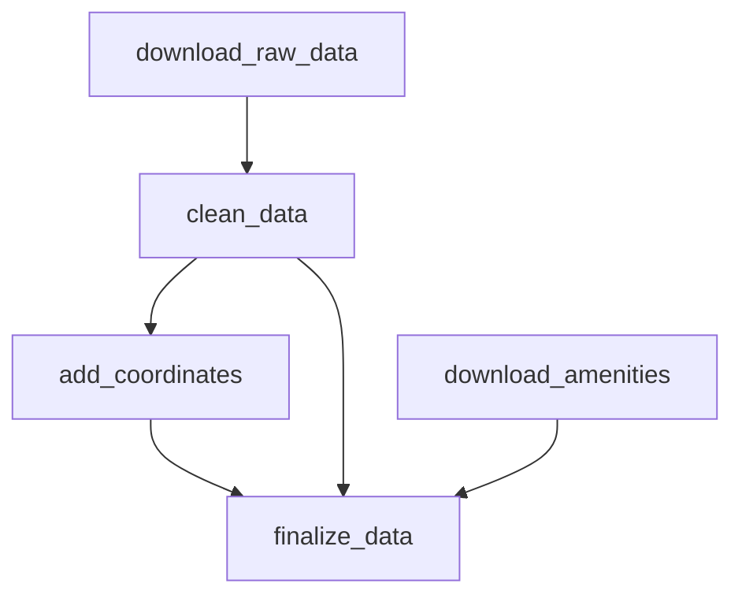

# ML Project for Real Estate Price Prediction

## System Architecture

## Research
- Data is versioned using DVC
- A CLI script is created for each data processing stage
- Experiments are logged using MLflow

Data Processing DAG

## Infrastructure
- Minio (buckets for DVC and MLflow)
- MLflow, PostgreSQL, PgAdmin
- Prometheus, Loki, Grafana

## Backend, Model Serving
- FastAPI, Catboost
- Loads the current model from Model Registry
- Sends logs to Loki
- Provides metrics for Prometheus

## Frontend
- Vite, React, Maplibre, MUI
- Provides users with a map interface
- Apartment distribution analytics
- Price prediction based on house and apartment characteristics

